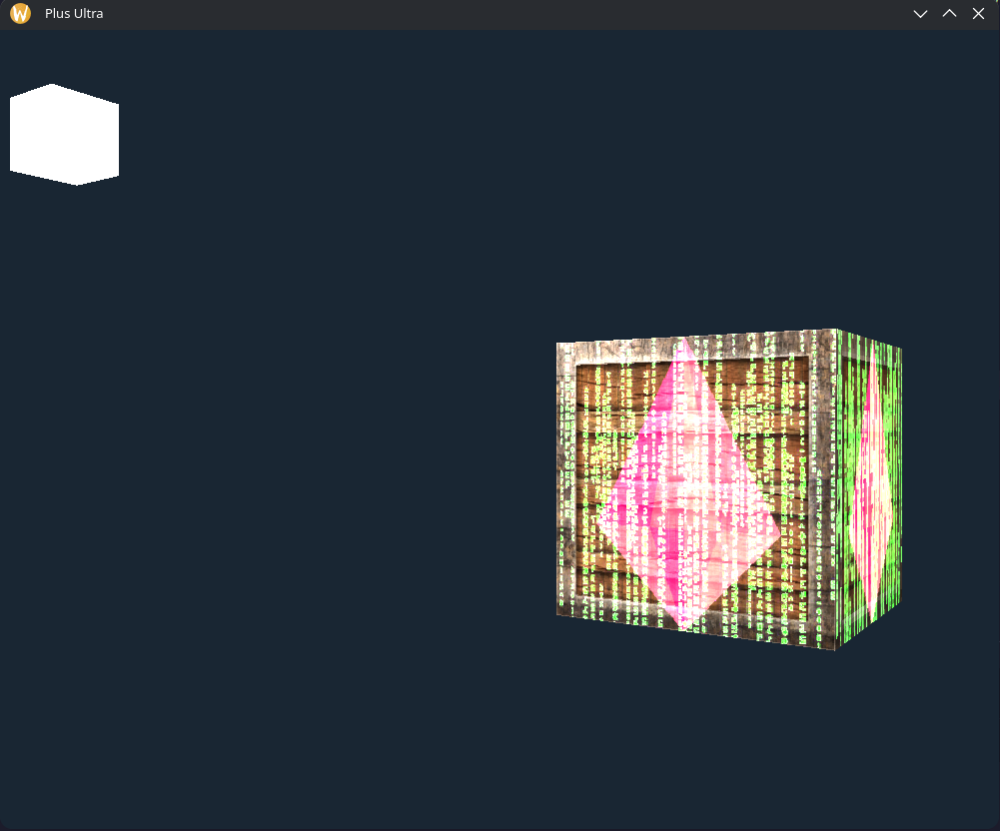

# My Learning OpenGL journey

## Building & Running Engine

- ./build.sh
- ./run.sh

## Building & Running Tests

- ./Tests/build-tests.sh
- ./Tests/run-tests.sh

## Progress

### Week 1

- Vectors
- Shaders
- First Triangle
- EBO , VBO & VAO
- Color Vertex data

### Week 2

- Shader class
- Textures & texture class
- UV / Texture Coordinates
- Mipmaps
- Texture Filtering
- Transformations
- Matrices
- Coordinate systems

### Week 3

- Complete Architecture redesign
- ECS-style framework
- Camera
- LookAt Matrix
- Arbitrary Axis Rotation
- Input

### Week 4

- Ambient, Diffuse & Specular lighting
- Normals & Normal Matrix
- Light entity
- Material properties
- Emission
- Diffuse , Specular & Emission maps
- Unit Tests
- Directional Lights , Point Lights & Spot Lights

